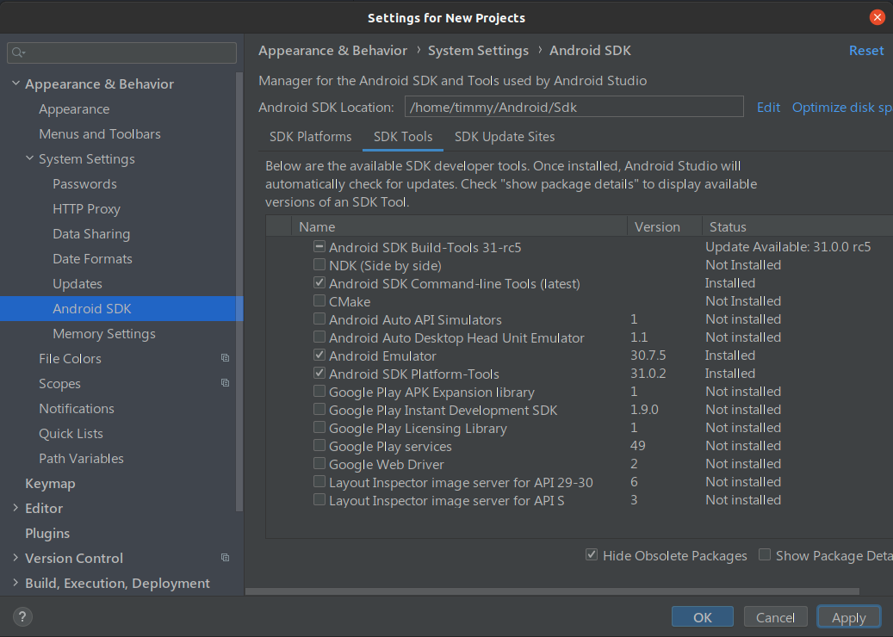

# Android 開發環境建置

# 目錄

<!-- @import "[TOC]" {cmd="toc" depthFrom=1 depthTo=6 orderedList=false} -->
<!-- code_chunk_output -->

- [Android 開發環境建置](#android-開發環境建置)
- [目錄](#目錄)
- [Dart](#dart)
- [Flutter](#flutter)
- [Android Studio](#android-studio)
- [DevTools](#devtools)
- [問題](#問題)
- [參考資料](#參考資料)

<!-- /code_chunk_output -->
# Dart
```
sudo sh -c 'wget -qO- https://dl-ssl.google.com/linux/linux_signing_key.pub | apt-key add -'
sudo sh -c 'wget -qO- https://storage.googleapis.com/download.dartlang.org/linux/debian/dart_stable.list > /etc/apt/sources.list.d/dart_stable.list'
sudo apt-get update
sudo apt-get install dart
```

# Flutter

```
sudo apt-get install clang cmake ninja-build pkg-config libgtk-3-dev
```

```
flutter doctor --android-licenses
```

```
sudo snap install flutter --classic
```

```
flutter config --enable-linux-desktop
```

```
flutter upgrade
```

```
flutter run
```

# Android Studio

```
flatpak install flathub com.google.AndroidStudio --system -y
```

```
flatpak run com.google.AndroidStudio
```

```
flutter config --android-studio-dir=/var/lib/flatpak/app/com.google.AndroidStudio/current/active/files/extra/android-studio
```

# DevTools
```
flutter pub global activate devtools
```

```
dart pub global activate devtools
```

```
dart pub global run devtools
```

```
cd path/to/flutter/app
flutter run
```

# 問題

```
Doctor summary (to see all details, run flutter doctor -v):
[✓] Flutter (Channel stable, 2.2.1, on Linux, locale zh_TW.UTF-8)
[!] Android toolchain - develop for Android devices
    ✗ Unable to locate Android SDK.
      Install Android Studio from: https://developer.android.com/studio/index.html
      On first launch it will assist you in installing the Android SDK components.
      (or visit https://flutter.dev/docs/get-started/install/linux#android-setup for detailed instructions).
      If the Android SDK has been installed to a custom location, please use
      `flutter config --android-sdk` to update to that location.

    ✗ No valid Android SDK platforms found in /usr/lib/android-sdk/platforms. Directory was empty.
[✓] Chrome - develop for the web
[!] Android Studio
    ✗ android-studio-dir = /var/lib/flatpak/app/com.google.AndroidStudio/current/active/files/extra/
    ✗ Unable to find bundled Java version.
[✓] Connected device (2 available)

! Doctor found issues in 2 categories.
```

```shell
flutter config --android-studio-dir=/var/lib/flatpak/app/com.google.AndroidStudio/current/active/files/extra/android-studio
```

```
Exception in thread "main" java.lang.NoClassDefFoundError: javax/xml/bind/annotation/XmlSchema
	at com.android.repository.api.SchemaModule$SchemaModuleVersion.<init>(SchemaModule.java:156)
	at com.android.repository.api.SchemaModule.<init>(SchemaModule.java:75)
	at com.android.sdklib.repository.AndroidSdkHandler.<clinit>(AndroidSdkHandler.java:81)
	at com.android.sdklib.tool.sdkmanager.SdkManagerCli.main(SdkManagerCli.java:73)
	at com.android.sdklib.tool.sdkmanager.SdkManagerCli.main(SdkManagerCli.java:48)
Caused by: java.lang.ClassNotFoundException: javax.xml.bind.annotation.XmlSchema
	at java.base/jdk.internal.loader.BuiltinClassLoader.loadClass(BuiltinClassLoader.java:581)
	at java.base/jdk.internal.loader.ClassLoaders$AppClassLoader.loadClass(ClassLoaders.java:178)
	at java.base/java.lang.ClassLoader.loadClass(ClassLoader.java:522)
	... 5 more
```

```
Doctor summary (to see all details, run flutter doctor -v):
[✓] Flutter (Channel stable, 2.2.1, on Linux, locale zh_TW.UTF-8)
[!] Android toolchain - develop for Android devices
    ✗ Unable to locate Android SDK.
      Install Android Studio from: https://developer.android.com/studio/index.html
      On first launch it will assist you in installing the Android SDK components.
      (or visit https://flutter.dev/docs/get-started/install/linux#android-setup for detailed instructions).
      If the Android SDK has been installed to a custom location, please use
      `flutter config --android-sdk` to update to that location.

    ✗ No valid Android SDK platforms found in /usr/lib/android-sdk/platforms. Directory was empty.
[✓] Chrome - develop for the web
[✓] Android Studio
[✓] Connected device (2 available)
    ! Device emulator-5558 is offline.

! Doctor found issues in 1 category.
```

```
Doctor summary (to see all details, run flutter doctor -v):
[✓] Flutter (Channel stable, 2.2.1, on Linux, locale zh_TW.UTF-8)
⣾[✓] Android toolchain - develop for Android devices (Android SDK version 30.0.3)
[✓] Chrome - develop for the web
[✓] Android Studio
[✓] Connected device (2 available)
    ! Device emulator-5558 is offline.

• No issues found!
```

```
5 of 6 SDK package licenses not accepted. 100% Computing updates...             
Review licenses that have not been accepted (y/N)? y

1/5: License android-googletv-license:
---------------------------------------
Terms and Conditions

This is the Google TV Add-on for the Android Software Development Kit License Agreement.

1. Introduction

...

14.7 This License Agreement, and your relationship with Google under this License Agreement, shall be governed by the laws of the State of California without regard to its conflict of laws provisions. You and Google agree to submit to the exclusive jurisdiction of the courts located within the county of Santa Clara, California to resolve any legal matter arising from this License Agreement. Notwithstanding this, you agree that Google shall still be allowed to apply for injunctive remedies (or an equivalent type of urgent legal relief) in any jurisdiction.


August 15, 2011
---------------------------------------
Accept? (y/N): y

2/5: License android-sdk-arm-dbt-license:
---------------------------------------
Terms and Conditions

This is the Android Software Development Kit License Agreement

1. Introduction

...

14.7 The License Agreement, and your relationship with Google under the License Agreement, shall be governed by the laws of the State of California without regard to its conflict of laws provisions. You and Google agree to submit to the exclusive jurisdiction of the courts located within the county of Santa Clara, California to resolve any legal matter arising from the License Agreement. Notwithstanding this, you agree that Google shall still be allowed to apply for injunctive remedies (or an equivalent type of urgent legal relief) in any jurisdiction.


January 16, 2019
---------------------------------------
Accept? (y/N): y

3/5: License android-sdk-preview-license:
---------------------------------------
To get started with the Android SDK Preview, you must agree to the following terms and conditions. As described below, please note that this is a preview version of the Android SDK, subject to change, that you use at your own risk. The Android SDK Preview is not a stable release, and may contain errors and defects that can result in serious damage to your computer systems, devices and data.

This is the Android SDK Preview License Agreement (the "License Agreement").

1. Introduction

...

14.7 The License Agreement, and your relationship with Google under the License Agreement, shall be governed by the laws of the State of California without regard to its conflict of laws provisions. You and Google agree to submit to the exclusive jurisdiction of the courts located within the county of Santa Clara, California to resolve any legal matter arising from the License Agreement. Notwithstanding this, you agree that Google shall still be allowed to apply for injunctive remedies (or an equivalent type of urgent legal relief) in any jurisdiction.

June 2014.
---------------------------------------
Accept? (y/N): y

4/5: License google-gdk-license:
---------------------------------------
This is a Developer Preview of the GDK that is subject to change.

Terms and Conditions

This is the Glass Development Kit License Agreement.

1. Introduction

...

14.7 This License Agreement, and your relationship with Google under this License Agreement, shall be governed by the laws of the State of California without regard to its conflict of laws provisions. You and Google agree to submit to the exclusive jurisdiction of the courts located within the county of Santa Clara, California to resolve any legal matter arising from this License Agreement. Notwithstanding this, you agree that Google shall still be allowed to apply for injunctive remedies (or an equivalent type of urgent legal relief) in any jurisdiction.

November 19, 2013
---------------------------------------
Accept? (y/N): y

5/5: License mips-android-sysimage-license:
---------------------------------------
MIPS Technologies, Inc. (“MIPS”) Internal Evaluation License Agreement for MIPS Android™ System Images for Android Software Development Kit (SDK): This Internal Evaluation License Agreement (this "Agreement") is entered into by and between MIPS and you (as an individual developer or a legal entity -- identified below as “Recipient”). MIPS shall make the Evaluation Software available to Recipient as described in accordance with the terms and conditions set forth below.

By clicking on the “Accept” button, downloading, installing, or otherwise using the Evaluation Materials (defined below), you agree to be bound by the terms of this Agreement effective as of the date you click “Accept” (the “Effective Date”), and if doing so on behalf of an entity, you represent that you are authorized to bind the entity to the terms and conditions of this Agreement. If you do not agree to be bound by the terms and conditions of this Agreement, do not download, install, or use the Evaluation Materials.

1. DEFINITIONS. These terms shall have the following meanings:

...

10.8 Open Source Software. In the event Open Source software is included with Evaluation Software, such Open Source software is licensed pursuant to the applicable Open Source software license agreement identified in the Open Source software comments in the applicable source code file(s) and/or file header as indicated in the Evaluation Software. Additional detail may be available (where applicable) in the accompanying on-line documentation. With respect to the Open Source software, nothing in this Agreement limits any rights under, or grants rights that supersede, the terms of any applicable Open Source software license agreement.
---------------------------------------
Accept? (y/N): y
All SDK package licenses accepted

```



# 參考資料
- Course
https://ithelp.ithome.com.tw/articles/10215158
- Issue
  - https://github.com/flutter/flutter/issues/18970
  - https://stackoverflow.com/questions/46402772/failed-to-install-android-sdk-java-lang-noclassdeffounderror-javax-xml-bind-a
- Flutter
  https://flutter.dev/docs/get-started/install
  https://flutter.dev/docs/get-started/install/linux
  https://flutter.dev/docs/get-started/install/linux#android-setup
- Android Studio
  - https://developer.android.com/studio
  - https://flathub.org/apps/details/com.google.AndroidStudio
- Dart
  - https://dart.dev/
  - https://dart.dev/get-dart#install-using-apt-get
  - https://dart.dev/tools/dart-devtools
  - https://dartpad.dev/
- DevTools
  - https://flutter.dev/docs/development/tools/devtools/overview
  - https://flutter.dev/docs/development/tools/devtools/cli
