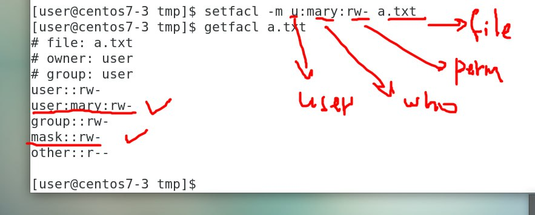

# 權限設定

## 基本權限設定

## ACL Rule

建立一個空白檔案：

```bash
touch a.txt
```

使用 `getfacl a.txt` 取得 ACL 權限資訊：

```bash
# file: a.txt
# owner: timmy
# group: timmy
user::rw-
group::rw-
other::r--
```

設定給 `` 使用者讀取權限：

```bash
```




## 參考資料

- https://ithelp.ithome.com.tw/articles/10221185