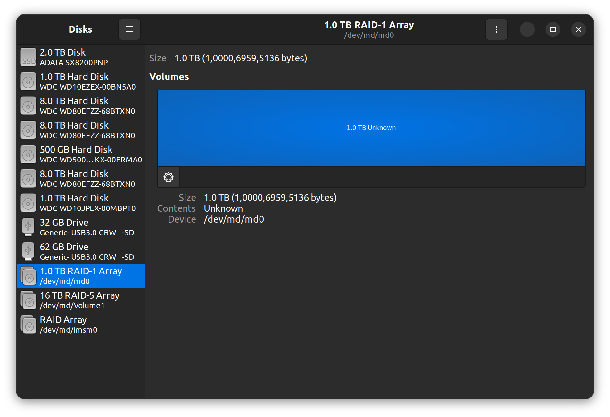

# RAID

## 安裝

```bash
sudo apt install mdadm
```

## mdadm 建立虛擬陣列磁碟

使用 `mdadm` 建立 RAID 。

以下是使用 `lsblk` 查詢硬碟，可以看到我有兩顆 1TB 的實體硬碟。

```bash
NAME        MAJ:MIN RM   SIZE RO TYPE  MOUNTPOINTS
loop0         7:0    0     4K  1 loop  /snap/bare/5
loop1         7:1    0  55.6M  1 loop  /snap/core18/2721
loop2         7:2    0  55.6M  1 loop  /snap/core18/2714
loop3         7:3    0  63.3M  1 loop  /snap/core20/1828
loop4         7:4    0  63.3M  1 loop  /snap/core20/1852
loop5         7:5    0    73M  1 loop  /snap/core22/583
loop6         7:6    0    73M  1 loop  /snap/core22/607
loop7         7:7    0 239.9M  1 loop  /snap/firefox/2487
loop8         7:8    0 241.9M  1 loop  /snap/firefox/2559
loop9         7:9    0 346.3M  1 loop  /snap/gnome-3-38-2004/119
loop10        7:10   0 349.7M  1 loop  /snap/gnome-3-38-2004/137
loop11        7:11   0 460.4M  1 loop  /snap/gnome-42-2204/68
loop12        7:12   0 460.6M  1 loop  /snap/gnome-42-2204/87
loop13        7:13   0  91.7M  1 loop  /snap/gtk-common-themes/1535
loop14        7:14   0  10.6M  1 loop  /snap/helm/353
loop15        7:15   0  11.2M  1 loop  /snap/helm/372
loop16        7:16   0  37.1M  1 loop  /snap/hunspell-dictionaries-1-7-2004/2
loop17        7:17   0  27.8M  1 loop  /snap/mdl/178
loop18        7:18   0  45.9M  1 loop  /snap/snap-store/599
loop19        7:19   0  45.9M  1 loop  /snap/snap-store/638
loop20        7:20   0  49.8M  1 loop  /snap/snapd/18357
loop21        7:21   0  49.8M  1 loop  /snap/snapd/18596
loop22        7:22   0   304K  1 loop  /snap/snapd-desktop-integration/49
loop23        7:23   0   428K  1 loop  /snap/snapd-desktop-integration/57
sda           8:0    0 931.5G  0 disk  
sdb           8:16   0   7.3T  0 disk  
├─md126       9:126  0  14.6T  0 raid5 
│ ├─md126p1 259:10   0   3.6T  0 part  /var/lib/gitlab
│ ├─md126p2 259:11   0   7.3T  0 part  /var/lib/libvirt/images
│ └─md126p3 259:12   0 931.3G  0 part  /opt/fpga
└─md127       9:127  0     0B  0 md    
sdc           8:32   0   7.3T  0 disk  
├─md126       9:126  0  14.6T  0 raid5 
│ ├─md126p1 259:10   0   3.6T  0 part  /var/lib/gitlab
│ ├─md126p2 259:11   0   7.3T  0 part  /var/lib/libvirt/images
│ └─md126p3 259:12   0 931.3G  0 part  /opt/fpga
└─md127       9:127  0     0B  0 md    
sdd           8:48   0 465.8G  0 disk  
sde           8:64   0   7.3T  0 disk  
├─md126       9:126  0  14.6T  0 raid5 
│ ├─md126p1 259:10   0   3.6T  0 part  /var/lib/gitlab
│ ├─md126p2 259:11   0   7.3T  0 part  /var/lib/libvirt/images
│ └─md126p3 259:12   0 931.3G  0 part  /opt/fpga
└─md127       9:127  0     0B  0 md    
sdf           8:80   0 931.5G  0 disk  
sdg           8:96   1  29.7G  0 disk  
└─sdg1        8:97   1  29.7G  0 part  /media/timmy/LUMIX
sdh           8:112  1    58G  0 disk  
└─sdh1        8:113  1    58G  0 part  /media/timmy/0018-7BC8
nvme0n1     259:0    0   1.9T  0 disk  
├─nvme0n1p1 259:1    0   476M  0 part  /boot/efi
├─nvme0n1p2 259:2    0   477M  0 part  /boot
├─nvme0n1p3 259:3    0   9.5G  0 part  /
├─nvme0n1p4 259:4    0 476.8G  0 part  /home
├─nvme0n1p5 259:5    0 119.2G  0 part  /opt
├─nvme0n1p6 259:6    0 119.2G  0 part  /var/snap/firefox/common/host-hunspell
│                                      /usr
├─nvme0n1p7 259:7    0 953.7G  0 part  /var
├─nvme0n1p8 259:8    0  30.5G  0 part  [SWAP]
└─nvme0n1p9 259:9    0 197.8G  0 part  
```

因此我用以下參數進行建立空間。因為 RAID 1 為一整個區塊，因此 `--chunk` 部份可以不用加上。 **如果是要用在開機使用，要多加一個參數 `--metadata=0.90` ，後續章節有說明**

```bash
sudo mdadm --create /dev/md/md0 --auto=yes --level=1 --chunk=256K --metadata=0.90 --raid-devices=2 --spare-devices=0 /dev/sd{a,f}
```

會出現 `Continue creating array?` 的詢問，這個時候輸入 `y` 的選項，即可完成。

```text
mdadm: partition table exists on /dev/sda
mdadm: partition table exists on /dev/sda but will be lost or
       meaningless after creating array
mdadm: Note: this array has metadata at the start and
    may not be suitable as a boot device.  If you plan to
    store '/boot' on this device please ensure that
    your boot-loader understands md/v1.x metadata, or use
    --metadata=0.90
mdadm: partition table exists on /dev/sdf
mdadm: partition table exists on /dev/sdf but will be lost or
       meaningless after creating array
Continue creating array? y
mdadm: Defaulting to version 1.2 metadata
mdadm: array /dev/md/md0 started.
mdadm: timeout waiting for /dev/md/md0
```

此時可以使用 `sudo mdadm --detail /dev/md/md0` 查詢相關資料。

```text
/dev/md/md0:
           Version : 1.2
     Creation Time : Wed Apr 19 02:46:08 2023
        Raid Level : raid1
        Array Size : 976630464 (931.39 GiB 1000.07 GB)
     Used Dev Size : 976630464 (931.39 GiB 1000.07 GB)
      Raid Devices : 2
     Total Devices : 2
       Persistence : Superblock is persistent

     Intent Bitmap : Internal

       Update Time : Wed Apr 19 02:49:49 2023
             State : clean, resyncing 
    Active Devices : 2
   Working Devices : 2
    Failed Devices : 0
     Spare Devices : 0

Consistency Policy : bitmap

     Resync Status : 2% complete

              Name : atca-system:md0  (local to host atca-system)
              UUID : 65cc0592:ccac9250:1214d2cb:9f9feac2
            Events : 44

    Number   Major   Minor   RaidDevice State
       0       8        0        0      active sync   /dev/sda
       1       8       80        1      active sync   /dev/sdf
```



## 建立 RAID 組態檔

組態檔案主要用於確保 mdadm 在自動開機的時候可以保證磁碟機的名稱是對應的，因為自動掛載會依照 UUID 進行判別，使用以下指令自動產生組態檔案：

```bash
sudo mdadm --examine --scan | sudo tee -a /etc/mdadm.conf
```

會產生以下：

```bash
ARRAY metadata=imsm UUID=d2b381dd:218ddf9d:0344e06d:813b3862
ARRAY /dev/md/Volume1 container=d2b381dd:218ddf9d:0344e06d:813b3862 member=0 UUID=926f3af9:4ad9d37b:f2761048:8c3ec4de
ARRAY /dev/md127 UUID=e2a4c5e5:164f02e3:ef242f65:a48d748b
```

## 管理 RAID 裝置

- `--add` ：Hotadd 後續裝置。
- `--remove` ：移除後續的非作用中裝置。
- `--fail` ：將後續裝置標示為錯誤。

同步

```bash
sudo sync
```

## RAID 1 開機無法組件問題

還好沒有將重要的資料放在未設定自動開機的 RAID 1 內，不然東西都消失，會慾哭無淚。如果一般流程建立 RAID 1 的話，會有以下訊息：

```text
mdadm: Note: this array has metadata at the start and
    may not be suitable as a boot device.  If you plan to
    store '/boot' on this device please ensure that
    your boot-loader understands md/v1.x metadata, or use
    --metadata=0.90
```

說明如果要用於自動開機的話，記得加上參數 `--metadata=0.90` ，因為開機時有機會 boot loader 無法辨識，造成無法掛載硬碟，作者我就是因為這樣造成給 FPGA 的相關環境直接死掉，還好只是程式而非撰寫資料，會需要花時間將所有程式下載回來。

```bash
sudo mdadm --create /dev/md/md0 --auto=yes --level=1 --chunk=256K --raid-devices=2 --spare-devices=0 /dev/sd{a,f} --metadata=0.90
```

## 參考資料

- [第十四章、磁碟配額(Quota)與進階檔案系統管理](https://linux.vbird.org/linux_basic/centos7/0420quota.php)
- [在 Oracle Linux 上建置軟體 RAID 陣列](https://docs.oracle.com/zh-tw/learn/ol-mdadm/#introduction)
- [阿就操場啊~](https://2formosa.blogspot.com/2017/04/mdadm-raid1-boot-metadata.html)
