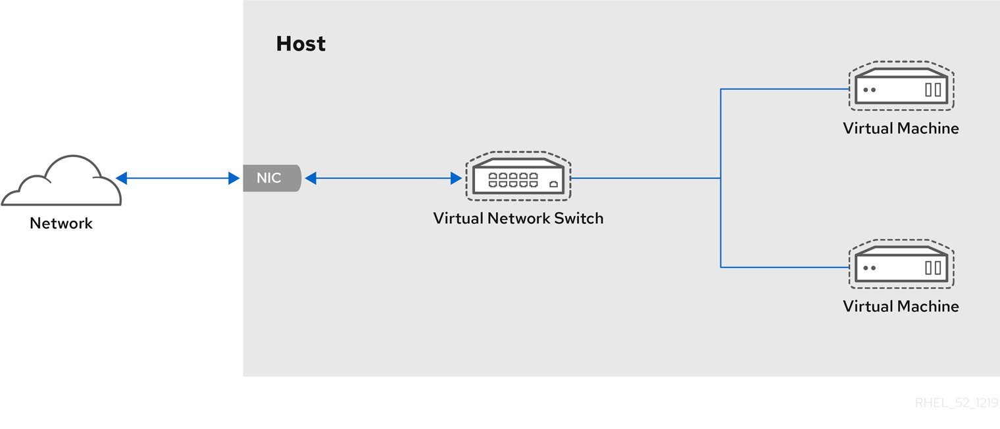

# NAS

## 目錄

- [NAS](#nas)
  - [目錄](#目錄)
  - [前言](#前言)
  - [環境佈署](#環境佈署)
  - [安裝 TrueNAS](#安裝-truenas)
  - [安裝 bashtop](#安裝-bashtop)
  - [NFS mount](#nfs-mount)
  - [網路設定](#網路設定)
    - [Libvirt 介紹](#libvirt-介紹)
    - [NAT Mode](#nat-mode)
    - [Bridged Mode](#bridged-mode)
    - [Router Mode](#router-mode)
      - [Proxy 解決無法連線網際網路](#proxy-解決無法連線網際網路)
  - [結論](#結論)
  - [參考資料](#參考資料)

## 前言

為了能夠提供更有效率的檔案管理與照片儲存與備份，以及面對 GitLab 免費用於使用者數量縮減，經過思考後決定購買新的電腦與新的硬碟，使用三顆 8TB 用 RAID 5 組成 16TB 硬碟空間。

為了可以架設 NAS ，因此整理相關說明與資料，經過查詢有建議使用 [TrueNAS](https://www.truenas.com/ 或者 OpenMediaVault 。如果使用 [TrueNAS](https://www.truenas.com/) 或者目前任何免費的 NAS 軟體，都是 OS 的形式，因此無法使 Docker 或者 Kubernetes 任何容器建立，看來會需要真實的安裝系統方式達到。

經過整理與查閱資料，發現沒有純粹的軟體安裝方式，都是以 OS 架構方式安裝提供環境使用，為了個人電腦環境使用，面對此問題個人會考慮使用為 Virtualbox 或者 [QEMU](https://www.qemu.org/) 等。

看過參考影片 [Stop using Virtualbox, Here's how to use QEMU instead](https://youtu.be/Kq849CpGd88) 後，決定使用也是屬於 Linux 的 [QEMU](https://www.qemu.org/) 虛擬主機，希望可以帶給我隔離的好環境，未來也會將 Docker 也轉為使用虛擬主機使用。

## 環境佈署

QEMU 因為使用 KVM 虛擬化技術，所以可以直接透過核心驅動讀取硬體溝通，與 Virtualbox 的一層虛擬化才可以運作的速度相比差距很大。

以下是安裝相依套件與軟體，都可以腳本自動化安裝所有東西與檔案，相關需要的技術與軟體都會在裡面。

```bash
sudo apt install qemu qemu-utils qemu-kvm -y -f
sudo apt install libvirt-clients libvirt-daemon-system \
  bridge-utils virtinst libvirt-daemon virt-manager -y -f
sudo apt install sshguard openssh-server mosh -y -f
sudo apt install seabios ovmf hugepages -y -f
sudo apt install cpu-checker -y -f
sudo apt install spice-vdagent -y -f
```

安裝好了之後確認一下 KVM 是否可以使用。

```bash
kvm-ok
sudo grep -c vmx /proc/cpuinfo
sudo grep -c svm /proc/cpuinfo
```

啟動 Libvirt 服務

```bash
sudo systemctl status libvirtd.service
```

加入群組，方便使用一般使用者呼叫使用。

```bash
sudo adduser $USER libvirt
sudo adduser $USER libvirt-qemu
```

## 安裝 TrueNAS

我們使用的 TrueNAS 發行版本為 TrueNAS CCALE ，基礎使用 Debian ，支援以下技術：

- Docker
- Virtual Machines
- Scaled-Out
- ZFS
- Converged
- Active-Active
- Linux Containers
- Hyperconverged
- Easy to Manage

等多種虛擬化技術，同時支援多種檔案功能，使用 Docker 架設自行想要的服務功能。

基本上安裝要下載 `iso` 映像檔，然後使用 QEMU 將檔案呼叫出來。

基本安裝教學可以參考 [QEMU-KVM 教學](https://github.com/twtrubiks/linux-note/tree/master/QEMU-KVM-tutorial) ，裡面講的相當實用，可惜在網路設定方面比較沒有琢磨。

## 安裝 bashtop

bashtop 是一個精美而且強大的指令環境監視器，可以在指令或者 bash 的情況下即時與動態的顯示電腦狀態，如果希望可以使用 ssh 連線檢視動態效能的話，推薦使用此軟體。

因為 TrueNAS 因為並未內建 `pip` ，但特別的是有內建 Python3 ，因此要自己重新下載安裝 `pip` ，建議統一在 `root` 安裝 `pip` 可以提供其他使用者使用。

```bash
wget https://bootstrap.pypa.io/get-pip.py
```

安裝 `pip` ：

```bash
sudo python get-pip.py
```

基本上這樣操作就可以把所有 `pip` 或者安裝的軟體都安裝好，速度也蠻快的，但就需要網際網路這樣。接下來安裝環境：

```bash
sudo python3 -m ensurepip
sudo python3 -m pip install psutil
```

接下來複製儲存庫到 `/usr/lib/` ：

```bash
cd /usr/lib/
git clone https://github.com/aristocratos/bashtop.git
cd /usr/bin/
ln -s /usr/lib/bashtop/bashtop bashtop
```

接下來使用 `bashtop` 就可以直接執行喔。另外，放在 `/usr/lib/` 提供其他 User 也可以使用喔，但權限的測試就需要各位自己嘗試設定了。

## NFS mount

需要安裝以下套件：

```bash
sudo apt install nfs-common
sudo apt-get install cifs-utils sshfs
sudo apt install autofs
```

之後呢進行掛載，基本上參數都差不多，但可以透過 `nosuid` 、 `noexec` 、 `nodev` 、 `rw -o bg` 、 `soft` 、 `rsize=1024` 、 `wsize=1024` 等針對掛載進行設定。

```bash
sudo mount -t nfs -o nosuid,noexec,nodev,rw -o bg,soft,rsize=1024,wsize=1024 10.1.1.178:/mnt/NAS/timmy /home/timmy/test-nas-nfs
```

另外，可以使用 autoufs 進行自動掛載的功能，提供需要使用時自動的掛載檔案與目錄的指定位置，其中分成兩個資料，一個是控制有哪些設定檔案要進行掛載的主要設定檔 `/etc/auto.master` ，一個是設定哪些目錄需要掛載的掛載設定檔，可以依照需求放在指定位置。

主要設定檔格式：

```config
自動掛載根目錄 目錄設定檔
```

\*註：自動掛載根目錄不需要存在，因為 `autofs` 會自動建立，如果建立會有出錯的問題。

因為有提供自動尋找的功能，所以可以統一放在 `/etc/auto.master.d/` 。在 `/etc/auto.master` 增加的內容：

```config
/home/timmy /etc/auto.master.d/auto.nfs
```

我們這邊使用 `sudo nano /etc/auto.master.d/auto.nfs` 加入一個新的檔案 `auto.nfs` ，格式為以下：

```bash
/local/path/folder -參數  <hostname>:/path/folder
```

選項與參數：

- 本地端次目錄：指的就是在 `/etc/auto.master` 內指定的目錄之次目錄
- -掛載參數：可以使用 `nosuid` 、 `noexec` 、 `nodev` 、 `rw -o bg` 、 `soft` 、 `rsize=1024` 、 `wsize=1024` 等參數，也可以不用使用。
- 伺服器所提供的目錄： 例如 192.168.100.254:/home/public 等

並寫上以下內容：

```bash
timmy         -bg,soft,rw,rsize=32768,wsize=32768 10.1.1.178:/mnt/NAS/timmy
treeocean     -bg,soft,rw,rsize=32768,wsize=32768 10.1.1.178:/mnt/NAS/treeocean
nquatcc       -bg,soft,rw,rsize=32768,wsize=32768 10.1.1.178:/mnt/NAS/nquatcc
timmy61109    -bg,soft,rw,rsize=32768,wsize=32768 10.1.1.178:/mnt/NAS/Users/timmy61109
```

## 網路設定

### Libvirt 介紹

基本上 Libvirt 是一個虛擬網路技術，標準的方式為一個「虛擬網路交換器」(Virtual Network Switches)連接到不同的「虛擬機器」(Virtual Machine)，會透過 `NIC` 通訊埠連接出去。因此要記得這樣的概念，後面在建置整個虛擬網路時才會有概念知道大家的教學在做什麼。



以下是我自行架設伺服器時使用 `ip addr show` 時候可以看到已經安裝的虛擬區域網路。看到這麼長長一大串可不要被嚇到了，因為這些都是虛擬化設備，也代表使用虛擬化設備相當多，很多資訊都盡量刪掉了，因為安全因素。

```text
1: lo: <LOOPBACK,UP,LOWER_UP> mtu 65536 qdisc noqueue state UNKNOWN group default qlen 1000
    link/loopback 00:00:00:00:00:00 brd 00:00:00:00:00:00
    inet xxx.xxx.xxx.xxx/8 scope host lo
       valid_lft forever preferred_lft forever
    inet6 1/ scope valid_lft preferred_lft forever
2: eno1: <BROADCAST,MULTICAST,UP,LOWER_UP> mtu 1500 qdisc fq_codel state UP group default qlen 1000
...    
2073627: nm-bridge: <BROADCAST,MULTICAST,UP,LOWER_UP> mtu 1500 qdisc noqueue state UP group default qlen 1000
    link/ether xx:xx:xx:xx:xx:xx brd ff:ff:ff:ff:ff:ff
1819677: virbr0: <BROADCAST,MULTICAST,UP,LOWER_UP> mtu 1500 qdisc noqueue state UP group default qlen 1000
    link/ether xx:xx:xx:xx:xx:xx brd ff:ff:ff:ff:ff:ff
    inet xxx.xxx.xxx.xxx/24 brd xxx.xxx.xxx.xxx scope global virbr0
       valid_lft forever preferred_lft forever
2049123: veth2c7b2c8@if2049122: <BROADCAST,MULTICAST,UP,LOWER_UP> mtu 1500 qdisc noqueue master docker0 state UP group default
    link/ether xx:xx:xx:xx:xx:xx brd ff:ff:ff:ff:ff:ff link-netnsid 0
    inet6 :::::/64 scope link
       valid_lft forever preferred_lft forever
...
2076905: vnet18: <BROADCAST,MULTICAST,UP,LOWER_UP> mtu 1500 qdisc noqueue master nm-bridge state UNKNOWN group default qlen 1000
    link/ether xx:xx:xx:xx:xx:xx brd ff:ff:ff:ff:ff:ff
    inet6 :::::/64 scope link
       valid_lft forever preferred_lft forever
2067945: virbr1: <BROADCAST,MULTICAST,UP,LOWER_UP> mtu 1500 qdisc noqueue state UP group default qlen 1000
    link/ether xx:xx:xx:xx:xx:xx brd ff:ff:ff:ff:ff:ff
    inet xxx.xxx.xxx.xxx/24 brd xxx.xxx.xxx.xxx scope global virbr1
       valid_lft forever preferred_lft forever
2076906: vnet19: <BROADCAST,MULTICAST,UP,LOWER_UP> mtu 1500 qdisc noqueue master virbr2 state UNKNOWN group default qlen 1000
    link/ether xx:xx:xx:xx:xx:xx brd ff:ff:ff:ff:ff:ff
    inet6 :::::/64 scope link
       valid_lft forever preferred_lft forever
2076910: vnet20: <BROADCAST,MULTICAST,UP,LOWER_UP> mtu 1500 qdisc noqueue master virbr0 state UNKNOWN group default qlen 1000
    link/ether xx:xx:xx:xx:xx:xx brd ff:ff:ff:ff:ff:ff
    inet6 :::::/64 scope link
       valid_lft forever preferred_lft forever
2076911: vnet21: <BROADCAST,MULTICAST,UP,LOWER_UP> mtu 1500 qdisc noqueue master virbr1 state UNKNOWN group default qlen 1000
    link/ether xx:xx:xx:xx:xx:xx brd ff:ff:ff:ff:ff:ff
2076661: virbr2: <BROADCAST,MULTICAST,UP,LOWER_UP> mtu 1500 qdisc noqueue state UP group default qlen 1000
    link/ether xx:xx:xx:xx:xx:xx brd ff:ff:ff:ff:ff:ff
    inet xxx.xxx.xxx.xxx/24 brd xxx.xxx.xxx.xxx scope global virbr2
       valid_lft forever preferred_lft forever
```

在使用的過程中，要學會幾項技能，第一個使用 `brctl show` 查閱虛擬交換器狀況，其中包括 `bridge name` 橋接名稱、 `bridge id` 橋接 ID 、 `STP` 生成樹協定啟用狀況、 `enabled` 橋接器啟用狀況、 `interfaces` 在虛擬交換器中有連接的虛擬/實體網路設備 。

```text
bridge name	bridge id		STP enabled	interfaces
br-e0f15a5f6a09		8000.xxxxxxxxxxxx	no		
docker0		8000.xxxxxxxxxxxx	no		veth238b58c
							veth2c7b2c8
							veth772a70f
							vethe7f4d31
docker_gwbridge		8000.xxxxxxxxxxxx	no		vethd483407
nm-bridge		8000.xxxxxxxxxxxx	yes		
virbr0		8000.xxxxxxxxxxxx	yes		vnet18
							vnet20
virbr1		8000.xxxxxxxxxxxx	yes		vnet21
virbr2		8000.xxxxxxxxxxxx	yes		vnet19
```

另外也可以使用 `virsh net-list --all` 查看每個虛擬交換器狀況。

```text
 Name        State    Autostart   Persistent
----------------------------------------------
 default     active   yes         yes
 network     active   yes         yes
 network-1   active   yes         yes
 truenas     active   yes         yes
```

### NAT Mode

沒有 IP 所以所建立的橋接器所連接的虛擬交換器無法使用 IP 溝通，因此才會需要透過設定。

### Bridged Mode

設定橋接器

目前知道，如果使用 https://youtu.be/DYpaX4BnNlg 的方法是可以成功，只是網卡會被替換掉，原本的 IP 就會不能使用，且除了原本的 IP 不能使用外，原本的界面會變成通道，形成橋接而失去原本的作用。

影片中的方式是建立一個虛擬交換器，而不是一個 NAT 路由器，所以在橋接內的區域網路都會可以使用外網的 DHCP ，但問題是原本GitLab的就會不能使用。

因為想要避開虛擬界面的 NAT 功能，來讓虛擬主機可以直接通道外部，所以需要重新設定橋接設定，來讓虛擬主機 IP 可以直接被外部DHCP設定。

### Router Mode

後來發現使用Router很好用，設定整棟路由表就可以連線，雖然橋接有橋接的好處，可惜如果使用路由模式，會造成內網沒有網際網路，因為在數據機的時候因為 NAT 無法將網際網路轉換回來，造成無法連接外面的網際網路，雖然可以透過 DNS 找到 IP ，但因為無法連接回來，因此無法正常使用。

#### Proxy 解決無法連線網際網路

透過區域網路內架設 Proxy 的方式，來解決無法連線到網際網路問題，同樣使用 Docker 或者其他人容器技術也可以做到。

透過以下指令快速建立 Proxy Server 。

```bash
docker run -d --name squid-container -e TZ=UTC -p 3128:3128 ubuntu/squid:latest
```

開啟防火牆設定。

```bash
sudo ufw allow 3128
```

通過 `curl` 測試代理伺服器是否正常運作。

```bash
curl --proxy http://hostname:3128 https://medium.com
```

## 結論

未來可能整個 DNS 、 DHCP 、 Gateway 、 Router 都會轉移到主機或者 Virtual Machines 、 Docker 、 Kubernetes 上面。

## 參考資料

- [Stop using Virtualbox, Here's how to use QEMU instead](https://youtu.be/Kq849CpGd88)
- [15 Best Free and Open Source NAS Software](https://techcult.com/best-free-and-open-source-nas-software/)
- [家用與企業用NAS軟體挑選術 2022版 (下)](https://osslab.tv/nas-software-2/)
- [家用與企業用NAS軟體挑選 2021版 (上)](https://osslab.tv/nas-software-1/)
- [花 250元自建 TrueNas Core 安裝紀錄](https://hackmd.io/@Not/TrueNasCoreInstall)
- [TrueNAS](https://www.truenas.com/)
  - [Installing SCALE](https://www.truenas.com/docs/scale/gettingstarted/install/installingscale/)
  - [TrueNAS CORE and Enterprise](https://www.truenas.com/docs/core/)
  - [看完搞不好會放棄 TrueNAS 自組 NAS 的 10 個經驗(含WOL喚醒與AWS雲端備份)](https://blog.user.today/10-free-truenas-note/)
- QEMU
  - [Wikipedia QEMU](https://zh.wikipedia.org/zh-tw/QEMU)
  - [QEMU](https://www.qemu.org/)
  - [qemu 虛擬機器](https://www.cyut.edu.tw/~ckhung/b/sa/qemu.php)
  - [五分鐘開始玩 qemu-kvm 虛擬機](https://newtoypia.blogspot.com/2015/02/qemu-kvm.html)
  - [QEMU-KVM 教學](https://github.com/twtrubiks/linux-note/tree/master/QEMU-KVM-tutorial)
  - [Documentation/Networking](https://wiki.qemu.org/Documentation/Networking#Virtual_Network_Devices)
  - [Linux QEMU-KVM 教學](https://youtu.be/702H2gkJzCE)
  - [Qemu/KVM & Virt-manager installation on Ubuntu 22.04](https://youtu.be/vyLNpPY-Je0)
- KVM
  - [Configuring Guest Networking](http://www.linux-kvm.org/page/Networking)
- NAT Mode
  - [KVM forward ports to guests VM with UFW on Linux](https://www.cyberciti.biz/faq/kvm-forward-ports-to-guests-vm-with-ufw-on-linux/)
  - [Bare Metal in the Cloud – Part 1 – Let’s Rent Hardware](https://blog.wirelessmoves.com/2022/04/bare-metal-in-the-cloud-part-1-lets-rent-hardware.html)
  - [Bare Metal Cloud – Part 2 – KVM and NAT Port Forwarding](https://blog.wirelessmoves.com/2022/04/bare-metal-cloud-part-2-kvm-and-nat-port-forwarding.html)
  - [Bare Metal Cloud – Part 3 – Several Public IPs – Macvtap vs. Bridging](https://blog.wirelessmoves.com/2022/04/bare-metal-cloud-part-3-several-public-ips-macvtap-vs-bridging.html)
  - [7.4. FORWARD 與 NAT 規則](https://web.mit.edu/rhel-doc/4/RH-DOCS/rhel-sg-zh_tw-4/s1-firewall-ipt-fwd.html)
  - [第四章、連上 Internet](https://linux.vbird.org/linux_server/centos6/0130internet_connect.php#note_files)
  - [第十二章 NAT 路由器及防火牆](https://www.twbsd.org/cht/book/new/ch12.htm)
  - [實地了解動手設定NAT 設定Cisco路由器節省IP使用量](https://www.netadmin.com.tw/netadmin/zh-tw/technology/D2A29F9258334DB3AF86A074E7931A7C)
  - [NAT穿透技術 從外部直接溝通私有IP](https://www.netadmin.com.tw/netadmin/zh-tw/technology/9E69BC3BDD3E427C8D1DAF3272983130)
  - [網路位址轉譯 (NAT) 常見問題](https://www.cisco.com/c/zh_tw/support/docs/ip/network-address-translation-nat/26704-nat-faq-00.html)
- Bridged Mode
  - [17.2. Bridged Mode](https://access.redhat.com/documentation/zh-tw/red_hat_enterprise_linux/7/html/virtualization_deployment_and_administration_guide/sect-bridge-mode)
  - Use nmtui
    - [How to set up a network bridge for virtual machine communication](https://www.redhat.com/sysadmin/setup-network-bridge-VM)
  - Use virsh
    - [How to configure network bridge for KVM virtual machines in Linux](https://bobcares.com/blog/configure-network-bridge-for-kvm-virtual-machines/)
  - veth(virtual Ethernet)
    - [[Linux] 內核虛擬Bridge, veth原理與實作 | Hands on Linux Kernel: bridge, veth](https://joehuang-pop.github.io/2020/04/26/Linux-%E5%85%A7%E6%A0%B8%E8%99%9B%E6%93%ACBridge-veth%E5%8E%9F%E7%90%86%E8%88%87%E5%AF%A6%E4%BD%9C-Hands-on-Linux-Kernel-bridge-veth/)
    - [Day 24: 什麼是 veth pair?](https://ithelp.ithome.com.tw/articles/10306574)
    - [qemu/kvm bridge and NAT networking](https://youtu.be/DYpaX4BnNlg)
- NAT Mode
  - [第九章、防火牆與 NAT 伺服器](https://linux.vbird.org/linux_server/centos6/0250simple_firewall.php)
  - [17.3. Network Address Translation](https://access.redhat.com/documentation/zh-tw/red_hat_enterprise_linux/7/html/virtualization_deployment_and_administration_guide/sect-virtual_networking-network_address_translation)
- Router Mode
  - [KVM: Creating a guest VM on a network in routed mode](https://fabianlee.org/2019/06/05/kvm-creating-a-guest-vm-on-a-network-in-routed-mode/)
  - [第八章、路由觀念與路由器設定](https://linux.vbird.org/linux_server/centos6/0230router.php)
  - [17.5. Routed Mode](https://access.redhat.com/documentation/zh-tw/red_hat_enterprise_linux/7/html/virtualization_deployment_and_administration_guide/sect-networking_protocols-routed_mode)
  - Static Route
    - [7-3 靜態繞路設定](http://www.tsnien.idv.tw/Manager_WebBook/chap7/7-3%20%E9%9D%9C%E6%85%8B%E7%B9%9E%E8%B7%AF%E8%A8%AD%E5%AE%9A.html)
    - [Routing Decision 路由判斷](https://www.jannet.hk/routing-decision-zh-hant/)
    - [路由協定基礎知識入門 詳解路由特性與分類](https://www.netadmin.com.tw/netadmin/zh-tw/technology/3F5D612B541C4D578C10E7DC75697B60)
    - [關於Router靜態路由設定觀念](https://ithelp.ithome.com.tw/questions/10194360)
- [openmediavault](https://www.openmediavault.org/)
- 相關網路技術
  - [第四章、連上 Internet](https://linux.vbird.org/linux_server/centos6/0130internet_connect.php)
  - [第三章、區域網路架構簡介](https://linux.vbird.org/linux_server/centos6/0120intranet.php)
  - [Oops Step ( Home lab of a kind ) 系列](https://ithelp.ithome.com.tw/users/20094403/ironman/2170)
  - 提供 Kubernetes 使用 NAS 容量空間作為 CSI 虛擬空間技術
    - [TrueNAS Container Storage Provider](https://github.com/hpe-storage/truenas-csp)
    - [HPE CSI Driver for Kubernetes Helm chart](https://artifacthub.io/packages/helm/hpe-storage/hpe-csi-driver)
  - [Ubuntu 18.04 透過 netplan 設定網路卡 IP](https://blog.toright.com/posts/6293/ubuntu-18-04-%E9%80%8F%E9%81%8E-netplan-%E8%A8%AD%E5%AE%9A%E7%B6%B2%E8%B7%AF%E5%8D%A1-ip.html)
  - [WireGuard](https://zh.wikipedia.org/zh-tw/WireGuard)
  - multipath
    - [5.8. 使用 multipath 指令來進行 Multipath 查詢](https://access.redhat.com/documentation/zh-tw/red_hat_enterprise_linux/6/html/dm_multipath/multipath_queries)
  - [Educational Network Simulator](http://malkiah.github.io/NetworkSimulator/)
  - [Open-Source Network Simulators](https://www.brianlinkletter.com/open-source-network-simulators/#netkit)
  - [Archives For VNX](https://www.brianlinkletter.com/tag/vnx/)
  - 子網路遮罩
    - [子網路](https://zh.wikipedia.org/zh-tw/%E5%AD%90%E7%BD%91)
    - [深入了解IP位址與子網路遮罩](https://www.netadmin.com.tw/netadmin/zh-tw/technology/D5162EE38674405EADB022E0802A05B2)
    - [理解網際網路協定（三）：何謂「子網路遮罩」，什麼又是「預設閘道」？](https://ithelp.ithome.com.tw/articles/10272208)
    - [子網路遮罩是什麼？](https://nordvpn.com/zh-tw/blog/ziwanglu-zhezhao/)
  - Libvirt
    - [libvirt VIRTUALIZATION API](https://libvirt.org/index.html)
    - [Virtual Networking](https://wiki.libvirt.org/VirtualNetworking.html)
    - [Chapter 17. Virtual Networking](https://access.redhat.com/documentation/zh-tw/red_hat_enterprise_linux/7/html/virtualization_deployment_and_administration_guide/chap-virtual_networking)
    - [Build a network emulator using Libvirt and KVM](https://www.brianlinkletter.com/2019/02/build-a-network-emulator-using-libvirt/)
    - [Deployment pre-requisites](https://libvirt.org/drvqemu.html#deployment-pre-requisites)
    - [Libvirt](https://ubuntu.com/server/docs/virtualization-libvirt)
    - [Oops Step ( Home lab of a kind ) 系列 libvirt](https://ithelp.ithome.com.tw/articles/10214584)
    - [架設 Linux KVM 虛擬化主機 (Set up Linux KVM virtualization host)](https://www.lijyyh.com/2015/12/linux-kvm-set-up-linux-kvm.html)
    - [章 15. 使​​​​​​​用​​​​​​​ virsh 來​​​​​​​管​​​​​​​理​​​​​​​虛​​​​​​​擬​​​​​​​主​​​​​​​機​​​​​​​](https://access.redhat.com/documentation/zh-tw/red_hat_enterprise_linux/5/html/virtualization/ch-virt-task-virsh)
    - [Networking](https://wiki.libvirt.org/Networking.html)
    - [Use virsh commands to manage KVM networking](https://www.techtarget.com/searchitoperations/tip/Use-virsh-commands-to-manage-KVM-networking)
